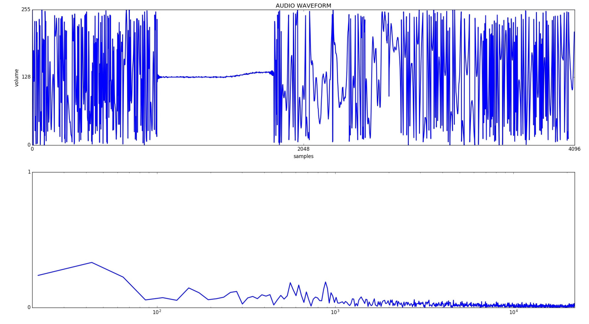

# 6.3 Речь в текст.

В оставшейся части этой главы мы будем внедрять систему распознавания и ответа голоса, а также создадим собственный настраиваемый голосовой интерфейс, с использованием Mycroft.

#### Процесс взаимодействия с роботом, можно разделить на следующие этапы:

1. Пробуждающее слово
2. Пауза, чтобы издать звуковой сигнал и показать, что робот слушает 
3. Команда или запрос от человека \(двигаться вперед один шаг\) 
4. Робот отвечает устно \(двигаясь вперед\)

В этом процессе участвуют две формы преобразования текста в речь, которые значительно упрощают работу робота. Во-первых, робот непрерывно слушает только один звук - пробуждающее слово. Это специфический звук, который означает только одно - будьте готовы обработать следующий звук в команде. Почему это необходимо? 

Поскольку у робота очень маленький процессор - Raspberry Pi - у него нет встроенной вычислительной мощности для запуска надежного механизма преобразования речи в текст \(STT\). Но мы можем его запустить с помощью простого распознавателя звука, который может воспринимать только пробуждающее слово. Вы знакомы с ним из других систем голосовых команд, таких как Алиса или Siri, которые тоже используют специальное слово или кнопку, чтобы начать работу. 

Как только будет получено пробуждающее слово, Raspberry Pi переключится в режим записи и запишет то, что мы скажем далее. Затем он передает эту информацию в онлайн-систему, the Google Cloud Speed to Text system \(то же самое, что и Google Assistant\).

Как робот распознает пробуждающее слово? Мы будем использовать речевую систему с открытым исходным кодом Mycroft, который использует один из двух методов. Первый - это система распознавания фонем под названием Sphynx. Слова состоят из отдельных звуков, которые мы приблизительно присваиваем буквам алфавита. Примером может служить звук п в слове «питомец» или «пикап». Мы создаем звук пппппп, соединяя наши губы. Вспышка звука, которую мы производим, идентифицируется как звук P - это фонема. У слова Альберт есть несколько фонем - звук A, звук ЛЬ, БЬ, ЭР и Т. Буквы, которые мы ассоциируем со звуками – Ч в черешня, ЭР у Альберта называются графемами, поскольку графически представляют эти звуки. Мы могли бы сказать, что проблема преобразования речи в текст состоит в том, чтобы сопоставить эти фонемы с графемами, но мы знаем, что это слишком просто - в любом языке есть всевозможные заимствованные слова и фразы, где произношение и орфография находятся далеко друг от друга.

Интерфейс распознавания речи использует фонемы для определения пробуждающего слова. У меня не было проблем с получением сигнала о пробуждении с расстояния в восемь футов. При изучении раздела настройки, мы изменим стандартное слово пробуждения Mycroft с "Hey, Mycroft" на "Hey, Albert".

Есть ли другие способы определить пробуждающее слово? Mycroft также может использовать обученную нейронную сеть, которая умеет распознавать слова по их спектральному графику мощности. Что такое спектральный график? Ваш голосовой звук не является одной частотой звуковой энергии - это сложное собрание различных частот, производимых нашими ртами и голосовыми связками. Если бы мы говорили на чистых частотах, то звучали бы как тона флейты на одной частоте. Нами может быть использован процесс, называемый быстрым преобразованием Фурье, чтобы преобразовать речь в график, который показывает количество энергии \(объем\) на каждой частоте. Это называется спектральным графиком. Низкие частоты слева, а более высокие частоты справа. Большая часть энергии речи человека сконцентрирована между частотами от 300 Гц до 4000 Гц. Каждое слово имеет уникальное распределение количества звуковой энергии на этих частотах и может быть распознано нейронной сетью следующим образом:

И метод фонемы, и метод нейронной сети используют спектральные графики для распознавания звуков как слов, но процесс распознавания фонемы делит слова на отдельные звуки, а нейронная сеть слушает и распознает все слово сразу. Почему это имеет большое значение? Система фонем может быть разработана для распознавания любого слова в языке без перепрограммирования или переобучения, в то время как нейросеть должна обучаться на каждом слове индивидуально, и может распознавать разные акценты.

Из главы нейронных сетей можно вспомнить, что нам нужны были маркированные данные для обучения нейронной сети. Мы использовали фотографии, тренируясь по каждому классу. Обучение ANN’s звуку проходит также: нужны звуки и связанные с ними слова. Можете ли вы придумать место, где вы получите образцы различных голосов? 

Наш следующий шаг после получения пробуждающего слова - записать звуки, которые слышит робот. Затем этого Mycroft передаст эти аудиоданные через интернет в онлайн-движок Google speech-to-text \( [https://cloud.google.com/speech-to-text/](https://cloud.google.com/speech-to-text/)  \). Это быстрый способ решить проблему Raspberry Pi.

Что происходит в Google Cloud? Движок STT разбивает речь на фонемы \(звуки\) и использует нейронную сеть для присвоения наиболее вероятных графем \(букв\) этих звуков. Выходные данные будут прописаны более фонетически, чем хотелось бы получить. Система STT использует словарные правила и словари для создания наиболее вероятного преобразования в обычные слова. Сюда входят как экспертные системы \(правила слова\), так и обученные нейронные сети, которые прогнозируют выходные слова на основе фонем. Этот шаг можно назвать языковой моделью. Наш STT выводит предложение и отправляет его роботу, все менее чем за 2 секунды.

