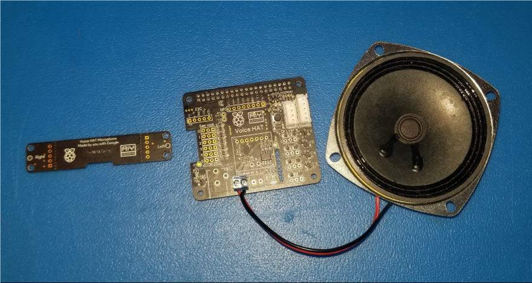

# 6.5  Mycroft Оборудование

Один из минусов Raspberry Pi – работа со звуком. В ней нет ни динамиков, ни микрофонов. Я нашел быстрый и эффективный способ решить эту проблему, используя существующий аппаратный комплект, который предоставляет  высококачественный динамик и отличный набор стерео микрофонов в удобном для робота форм-факторе. Отметим, что он работает только с платой Raspberry Pi 3 , он не будет работать с более ранней Raspberry Pis. Комплект - Google AIY Voice Kit. Веб-сайт - [http://aiyprojects.withgoogle.com ](https://aiyprojects.withgoogle.com/).



Оригинальный комплект содержит шляпу или вспомогательную плату для Raspberry Pi 3, которая расположена поверх основной платы и имеет интерфейсы для громкоговорителя, а также набор стереомикрофонов. При желании можно использовать API Google Assistant, который идет с этим набором, но я не смог заставить его работать с ROS, а это очень важно для нашего робота.

Вместо этого я решил использовать программное обеспечение голосового помощника Mycroftа, которое предлагало большую часть тех же функций, но в более удобной для пользователя системе. Мы рассмотрим Mycroftа в следующем разделе после установки оборудования. Выключите Pi и установите Voice Hat в верхней части платы Raspberry Pi 3. Будьте осторожны.

Следующим шагом является соединение динамиков с винтовыми клеммами. Подключите микрофоны через разъем JST. Это разъем на верхней части, который имеет пять проводов. На этом аппаратная часть установки заканчивается.

Включите Raspberry Pi 3 с новым динамиком и микрофоном.

Теперь мы можем погрузиться в  работу с программным обеспечением.

Необходимо скачать драйверы программного обеспечения для Google AIY Voice Kit с сайта GiHub. Мы будем использовать драйверы, но должны скачать все.


Перейдите на сайт Google AIY проекта Raspian GitHub: [https://github.com/google/aiyprojects-raspbian](https://github.com/google/aiyprojects-raspbian) , введите следующий код:

```text
Sudo apt-get update
Cd
```

Запустите Pulse Audio. После выполнения этого шага может потребоваться перезагрузка:

```text
pulseaudio –D
```

Вернитесь в домашний каталог:

```text
cd
```

Теперь мы загружаем исходный код проекта AIY на наш RasPi:

```text
git clone https://github.com/google/aiyprojects-raspbian.git voicerecognizer-
raspi
cd ~/voice-recognizer-raspi
```

С помощью этих сценариев будут установлены звуковые драйверы:

```text
sudo scripts/configure-driver.sh
sudo scripts/install-alsa-config.sh
```

Теперь необходимо перезагрузить Pi:

```text
sudo reboot
```

После перезагрузки мы можем протестировать настроенный звук:

```text
speaker-test –c2
```

Будет воспроизводиться белый шум от динамиков. Можно также попробовать следующее:

```text
speaker-test -c2 --test=wav -w /usr/share/sounds/alsa/Front_Center.wav
```

Если у вас не воспроизводятся эти звуки, попробуйте переустановить драйверы и перезагрузить компьютер, а также проверьте провода.

